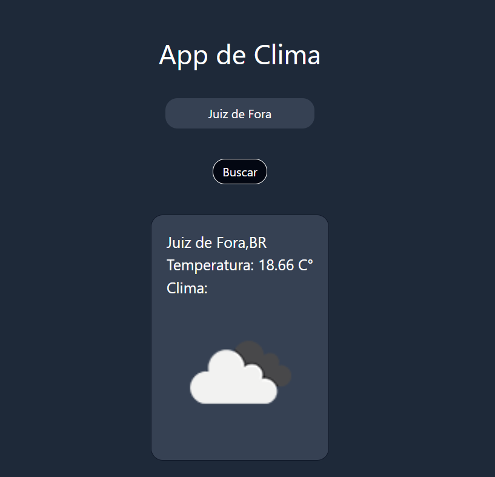

# 🏠 Weather App

## 👋 Seja bem-vindo

Este projeto foi desenvolvido para o treinamento do uso de API
É um site funcional que usa a API OpenWeatherMap, para interativamente mostrar o clima da cidade digitada pelo usuario

## 🛠️ Tecnologias utilizadas

- React.js
- Vite
- Tailwind CSS

## 💡 O que aprendi/fiz de novo

- Manipulação de API com `fetch`
- Manipulação de Error
- Utilização de Hooks `useState`
- Mostrar dados na tela após uma requisição
- Estilização da pagina com o Tailwind CSS
